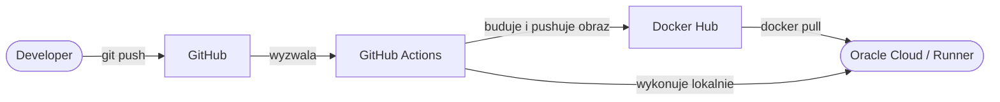

# Projekt 3 — Flask CI/CD Pipeline (Self-Hosted Runner)

Wersja projektu 3 z self-hosted runnerem działającym bezpośrednio na serwerze Oracle Cloud. W przeciwieństwie do brancha `master` gdzie pipeline wykonuje się na maszynach GitHuba, tutaj GitHub wysyła zadania do runnera zainstalowanego na docelowym serwerze.

Główna różnica praktyczna: brak osobnego kroku SSH do deploymentu.  Runner już jest na serwerze więc komendy `docker pull` i `docker run` wykonują się lokalnie.

## Porównanie podejść

| | master | self-hosted-runner |
|---|---|---|
| Runner | GitHub (ubuntu-latest) | Serwer Oracle Cloud |
| Deploy | przez SSH | lokalnie na serwerze |
| Koszt minut GitHub Actions | tak | nie |
| Wymagania | brak | runner zainstalowany na serwerze |

## Jak działa pipeline



## Konfiguracja self-hosted runnera

1. Wejdź na GitHubie → **Settings → Actions → Runners → New self-hosted runner**
2. Wybierz **Linux x64** i wykonaj komendy które GitHub pokazuje na serwerze
3. Uruchom runner jako serwis systemowy:
```bash
sudo ./svc.sh install
sudo ./svc.sh start
```
4. Upewnij się że masz zainstalowany Docker Buildx:
```bash
sudo apt install docker-buildx -y
```
5. Jeśli serwer ma mało RAM (poniżej 2GB), dodaj swap:
```bash
sudo fallocate -l 2G /swapfile
sudo chmod 600 /swapfile
sudo mkswap /swapfile
sudo swapon /swapfile
echo '/swapfile none swap sw 0 0' | sudo tee -a /etc/fstab
```

## Wymagania

- Python 3.10+ i pip (do uruchomienia lokalnego)
- LUB Docker i Docker Compose (do uruchomienia w kontenerze)
- Konto Docker Hub
- Serwer z Linuxem, Dockerem i zainstalowanym GitHub Actions Runner

## Jak uruchomić lokalnie

1. Sklonuj repozytorium:
```bash
git clone https://github.com/PATRYKK2005/flask-cicd-pipeline
cd flask-cicd-pipeline
```

2. Stwórz i aktywuj wirtualne środowisko:
```bash
python -m venv .venv
.venv\Scripts\activate      # Windows
source .venv/bin/activate   # Linux/Mac
```

3. Zainstaluj zależności:
```bash
pip install -r requirements.txt
```

4. Uruchom aplikację:
```bash
python app.py
```

5. Aplikacja będzie dostępna pod adresem `http://127.0.0.1:5000`

## Jak uruchomić przez Docker Compose

1. Stwórz plik `.env` na podstawie `.env.example` i uzupełnij wartości
2. Uruchom:
```bash
docker compose up --build
```
3. Aplikacja będzie dostępna pod `http://localhost:5000`

## Konfiguracja CI/CD

| Sekret | Opis |
|--------|------|
| `DOCKER_USERNAME` | Nazwa użytkownika Docker Hub |
| `DOCKER_PASSWORD` | Hasło do konta Docker Hub |
| `DATABASE_URL` | Pełny adres połączenia z bazą danych |

## Zmienne środowiskowe

| Zmienna | Opis |
|---------|------|
| `POSTGRES_USER` | Nazwa użytkownika bazy danych |
| `POSTGRES_PASSWORD` | Hasło do bazy danych |
| `POSTGRES_DB` | Nazwa bazy danych |
| `DATABASE_URL` | Pełny adres połączenia z bazą |

## Endpointy

| Endpoint | Metoda | Opis |
|----------|--------|------|
| `/` | GET | Zwraca status serwera |
| `/baza` | GET | Zwraca wszystkie wpisy z bazy danych |
| `/baza` | POST | Dodaje nowy wpis, wymagane pola: `{"title": "...", "content": "..."}` |

## Działająca aplikacja

**http://152.70.46.21:5000**