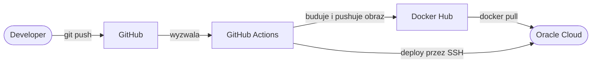

# Projekt 3 — Flask CI/CD Pipeline

Rozbudowa projektu 2 o automatyczny pipeline CI/CD. Każdy push na branch `master` automatycznie buduje obraz Dockera, pushuje go na Docker Hub i deployuje aplikację na zdalny serwer w chmurze Oracle Cloud. Aplikacja działa publicznie w internecie bez żadnej ręcznej interwencji.

## Jak działa pipeline



## Wymagania

- Python 3.10+ i pip (do uruchomienia lokalnego)
- LUB Docker i Docker Compose (do uruchomienia w kontenerze)
- Konto Docker Hub (do CI/CD)
- Serwer z Linuxem i Dockerem (do deploymentu)

## Jak uruchomić lokalnie

1. Sklonuj repozytorium:
```bash
git clone https://github.com/PATRYKK2005/flask-cicd-pipeline
cd flask-cicd-pipeline
```

2. Stwórz i aktywuj wirtualne środowisko:
```bash
python -m venv .venv
.venv\Scripts\activate      # Windows
source .venv/bin/activate   # Linux/Mac
```

3. Zainstaluj zależności:
```bash
pip install -r requirements.txt
```

4. Uruchom aplikację:
```bash
python app.py
```

5. Aplikacja będzie dostępna pod adresem `http://127.0.0.1:5000`

## Jak uruchomić przez Docker Compose

1. Stwórz plik `.env` na podstawie `.env.example` i uzupełnij wartości
2. Uruchom:
```bash
docker compose up --build
```
3. Aplikacja będzie dostępna pod `http://localhost:5000`

## Konfiguracja CI/CD

Aby uruchomić własny pipeline, dodaj następujące sekrety w ustawieniach repozytorium na GitHubie (Settings → Secrets and variables → Actions):

| Sekret | Opis |
|--------|------|
| `DOCKER_USERNAME` | Nazwa użytkownika Docker Hub |
| `DOCKER_PASSWORD` | Hasło do konta Docker Hub |
| `SERVER_IP` | Publiczny adres IP serwera |
| `SERVER_USER` | Nazwa użytkownika na serwerze (np. `ubuntu`) |
| `SSH_PRIVATE_KEY` | Prywatny klucz SSH do połączenia z serwerem |
| `DATABASE_URL` | Pełny adres połączenia z bazą danych |

## Zmienne środowiskowe (uruchomienie lokalne)

Stwórz plik `.env` na podstawie `.env.example`:

| Zmienna | Opis |
|---------|------|
| `POSTGRES_USER` | Nazwa użytkownika bazy danych |
| `POSTGRES_PASSWORD` | Hasło do bazy danych |
| `POSTGRES_DB` | Nazwa bazy danych |
| `DATABASE_URL` | Pełny adres połączenia z bazą |

## Endpointy

| Endpoint | Metoda | Opis |
|----------|--------|------|
| `/` | GET | Zwraca status serwera |
| `/baza` | GET | Zwraca wszystkie wpisy z bazy danych |
| `/baza` | POST | Dodaje nowy wpis, wymagane pola: `{"title": "...", "content": "..."}` |

## Działająca aplikacja

Aplikacja jest publicznie dostępna pod adresem:

**http://152.70.46.21:5000**

